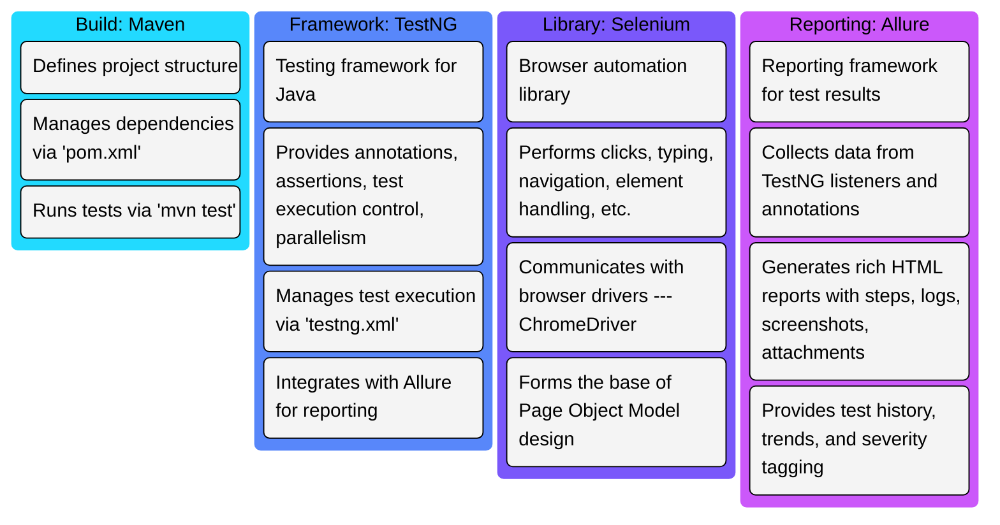
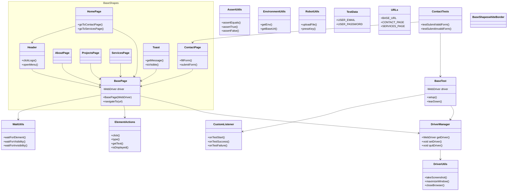

# Functional Documentation for the Test Automation Framework

```mermaid
---
config:
  theme: 'base'
  themeVariables:
    primaryColor: '#a2e9fc'
    primaryTextColor: '#000000'
    primaryBorderColor: '#000000'
    lineColor: '#f2ff00'
    secondaryColor: '#ffffff'
    tertiaryColor: '#6ee7ff'
---

kanban
  column2[Build: Maven]
    id3[Defines project structure]
    id3[Manages dependencies via 'pom.xml']
    id3[Runs tests via 'mvn test']

  column3[Framework: TestNG]
    id3[Testing framework for Java]
    id3[Provides annotations, assertions, test execution control, parallelism]
    id3[Manages test execution via 'testng.xml']
    id3[Integrates with Allure for reporting]

  column4[Library: Selenium]
    id3[Browser automation library]
    id3[Performs clicks, typing, navigation, element handling, etc.]
    id3[Communicates with browser drivers --- ChromeDriver]
    id3[Forms the base of Page Object Model design]

  column5[Reporting: Allure]
    id3[Reporting framework for test results]
    id3[Collects data from TestNG listeners and annotations]
    id3[Generates rich HTML reports with steps, logs, screenshots, attachments]
    id3[Provides test history, trends, and severity tagging]

```

```mermaid
---


---

classDiagram
    %% ========== Core =============
    class DriverManager {
        +WebDriver getDriver()
        +void setDriver()
        +void quitDriver()
    }

    class DriverUtils {
        +takeScreenshot()
        +maximizeWindow()
        +closeBrowser()
    }

    class WaitUtils {
        +waitForElement()
        +waitForVisibility()
        +waitForInvisibility()
    }

    class ElementActions {
        +click()
        +type()
        +getText()
        +isDisplayed()
    }

    class AssertUtils {
        +assertEquals()
        +assertTrue()
        +assertFalse()
    }

    class EnvironmentUtils {
        +getEnv()
        +getBaseUrl()
    }

    class RobotUtils {
        +uploadFile()
        +pressKey()
    }

    %% ========== Data =============
    class TestData {
        +USER_EMAIL
        +USER_PASSWORD
    }

    class URLs {
        +BASE_URL
        +CONTACT_PAGE
        +SERVICES_PAGE
    }

    %% ========== Pages =============

    namespace BaseShapes {
        class BasePage {
            -WebDriver driver
            +BasePage(WebDriver)
            +navigateTo(url)
        }

        class HomePage {
            +goToContactPage()
            +goToServicesPage()
        }

        class ContactPage {
            +fillForm()
            +submitForm()
        }

        class AboutPage
        class ProjectsPage
        class ServicesPage

        %% Components (small reusable)
        class Header {
            +clickLogo()
            +openMenu()
        }

        class Toast {
            +getMessage()
            +isVisible()
        }
    }
    %% ========== Test Layer ==========
    class BaseTest {
        -WebDriver driver
        +setup()
        +tearDown()
    }

    class ContactTests {
        +testSubmitValidForm()
        +testSubmitInvalidForm()
    }

    %% ========== Listeners ==========
    class CustomListener {
        +onTestStart()
        +onTestSuccess()
        +onTestFailure()
    }

    %% ========== Relationships ==========
    DriverManager --> DriverUtils
    BasePage --> DriverManager
    BasePage --> ElementActions
    BasePage --> WaitUtils

    HomePage --> BasePage
    ContactPage --> BasePage
    AboutPage --> BasePage
    ProjectsPage --> BasePage
    ServicesPage --> BasePage

    Header --> BasePage
    Toast --> BasePage

    BaseTest --> DriverManager
    BaseTest --> CustomListener
    ContactTests --> BaseTest
    ContactTests --> ContactPage
    HomePage --> Header

%% 🔹 Style for namespace border
style BaseShapes stroke:#ffffff,stroke-width:2px,fill:#222222,color:#ffffff

%% Apply to namespace (BaseShapes)
class BaseShapes whiteBorder


```
