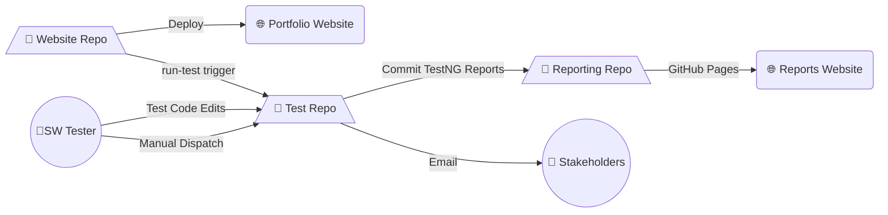

# 🧪 Test Automation Framework

[](https://www.oracle.com/java/)
[](https://maven.apache.org/)
[](https://testng.org/)
[](https://www.selenium.dev/)
[](https://github.com/MahmoudFawzyAOE2/mft1998-portfolio-TestAutomation/actions)

A **UI test automation framework** built with **Java, TestNG, and Selenium**.  
This project is designed for testing core functionalities of My portfolio website, with support for CI/CD pipelines via **GitHub Actions**.

---

## 📂 Project Structure

```
├── .github/workflows/       # GitHub Actions CI/CD workflows
├── src/
│   ├── main/java/           # Framework source code
│   │   ├── drivers/         # WebDriver setup and management
│   │   ├── listeners/       # TestNG custom listeners
│   │   ├── pages/           # Page Object Model (POM) classes
│   │   │   └── components/  # Reusable UI components
│   │   ├── testData/        # Centralized test data (URLs, constants)
│   │   └── utils/           # Utilities (Waits, Actions, Assertions, etc.)
│   └── test/java/           # Test classes
│       └── tests/ui/        # UI tests
├── test-output/             # Default TestNG reports (auto-generated)
├── pom.xml                  # Maven dependencies & build config
└── testng.xml               # TestNG suite configuration
```

---

## 🚀 Features

- **UI Automation** using **Selenium + TestNG**
- **Page Object Model (POM)** for clean and reusable test code
- **Utilities layer** for common actions (waits, assertions, element interactions, etc.)
- **TestNG Listeners** for reporting and preserving execution Logs 
- **Custom Reports** TestNG (HTML, XML)
- **GitHub Actions Integration** for CI/CD pipelines
- **Separation of Concerns**:  
  - `src/main/java` → Framework code  
  - `src/test/java` → Test cases

---

## ⚙️ Setup & Installation

1. **Clone the Repository**
   ```bash
   git clone https://github.com/MahmoudFawzyAOE2/mft1998-portfolio-TestAutomation.git
   cd **mft1998-portfolio-TestAutomation**
   ```

2. **Install Dependencies**
   Ensure you have **Maven** installed. Then run:
   ```bash
   mvn clean install
   ```

3. **Run Tests**
   - Run all tests:
     ```bash
     mvn clean test
     ```

---

## 📊 Reports

- **Default TestNG Reports** → `test-output/`  
  Includes HTML reports with screenshots of passed, failed, and skipped tests.

---

## 🖥️ CI/CD Integration

This project is configured with **GitHub Actions** (`.github/workflows/`):
- `Run Tests.yml` → Executes the test suite on push

Test results and reports are committed to the reporting repo as GitHub Actions artifacts.
- [Portfolio Website](https://mahmoudfawzyaoe2.github.io/mft1998/)
- [Reports Website](https://mahmoudfawzyaoe2.github.io/mft1998-portfolio-TestReport/)

### 🔄 Workflow Between Repositories

The CI/CD process connects **three repositories**:

1. **[Website Repo](https://github.com/MahmoudFawzyAOE2/mft1998-portfolio)**
    - Stores portfolio website code.
    - Fires the **`run-test` trigger** whenever changes are deployed.

2. **Test Repo** (This Repo)
    - Contains test automation code .
    - Executes test cases when triggered by:
        - Manual workflow dispatch, or
        - Tests edits (push to this Repo), or
        - Trigger event from Website Repo.
    - Generates **test reports**.
    - Commits Test Reports to the Reporting Repo 
    - Sends an Email which notifies about the done tests and includes a link to the reporting website

3. **[Reporting Repository](https://github.com/MahmoudFawzyAOE2/mft1998-portfolio-TestReport)**
    - Stores the generated **test reports**.
    - Publishes them via **GitHub Pages** for public access.

### 📊 Repository Interaction Graph



## 🔧 Tech Stack

- **Language:** Java 17+
- **Build Tool:** Maven
- **Test Framework:** TestNG
- **UI Automation:** Selenium WebDriver
- **CI/CD:** GitHub Actions

---

## 📌 Next Improvements

- [ ] Enhance The CI/CD Triggers to exclude non-code related changes
- [ ] Add more custom listeners for better events logging
- [ ] Add Utils Documentation
- [ ] Add parallel test execution  
- [ ] Add Screenshot for better reporting
- [ ] Add Allure Reports
- [ ] Add API Tests using RestAssured
- [ ] Improve test categorization (smoke, regression, API, UI)  

---

## 👤 Author

**Mahmoud Fawzy**  
🔗 [GitHub](https://github.com/MahmoudFawzyAOE2) | [LinkedIn](https://linkedin.com/in/mft1998)

---